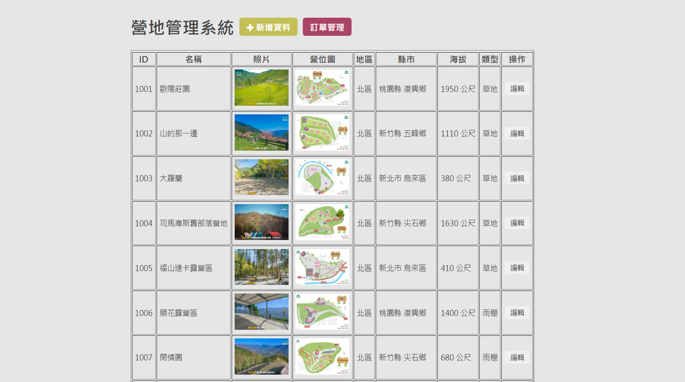
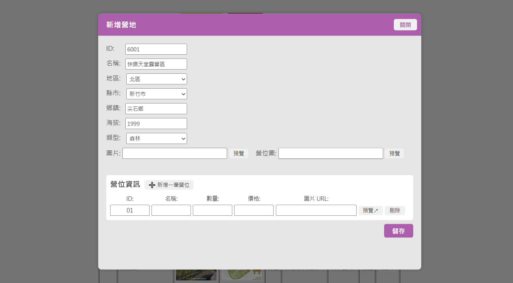
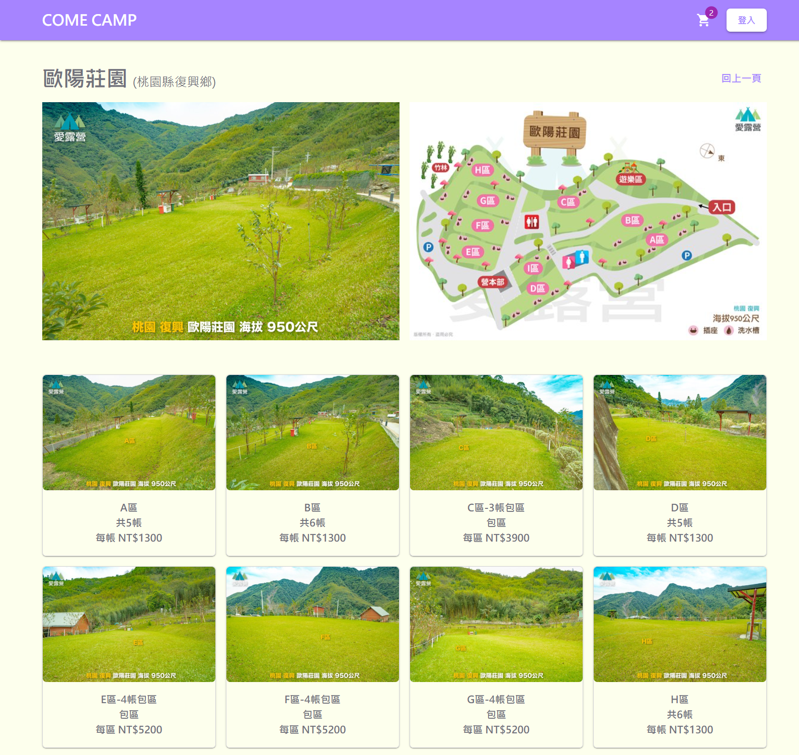
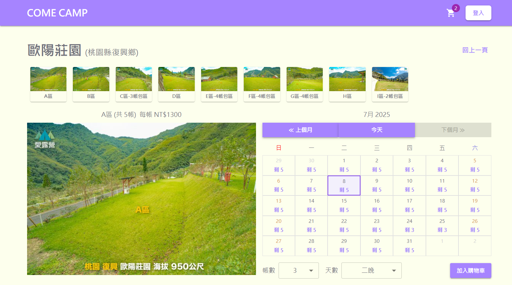
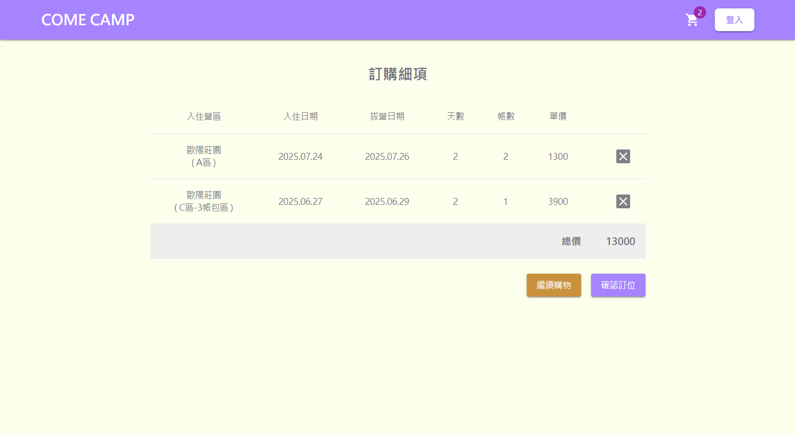

# COME CAMP

## 前往 [COME CAMP](http://bettysu-info.duckdns.org/)

COME CAMP 是一個結合對露營的喜好，與學習全端開發為方向的全端作品，希望透過這個實作專案，練習前後端分離的開發流程，打造出一個實用的「營區預訂平台」。

本專案包含兩大主要功能模組：

- 前端使用者介面：提供營區瀏覽、營位預訂、購物車操作與訂單送出。

- 後端管理工具：可管理營區資料、營位設定、訂單清單，以及開放每月預訂資料。

專案採用 React（前端）與 Node.js + MongoDB（後端）開發，
並透過 .env 環境變數來分離開發與部署設定。


## 頁面介紹

### 🏕️ 前台

#### 首頁
- 營區清單串接資料庫（MongoDB）
- 提供地區與類型標籤篩選
- 以卡片呈現營區基本資訊（圖片、海拔、地點）

#### 營區詳細頁（Detail 頁）
- 顯示營位地圖、營位清單（串資料）
- 選擇營位後進入預訂頁面
- 顯示目前剩餘數量

#### 預訂頁
- 切換營位、選擇日期、夜數與帳數
- 加入購物車功能（可多筆）
- 顯示每日可預訂數量、過期灰色不可選

#### 購物車頁
- 顯示所有選擇的營位項目
- 可移除項目
- 結帳功能（送出訂單並更新庫存）

---

### 🛠️ 管理員後台

#### 營區管理
- 營區清單：讀取所有營區資料
- 新增營區：基本資料 + 營位設定 + 開放訂位
- 修改營區：載入並更新資料
- 使用 Pug 頁面，搭配 Modal 彈窗編輯

#### 訂單管理
- 顯示所有訂單（多營位資料）
- 支援多營位合併顯示、建立時間排序

#### 開放預訂設定
- 判斷最新開放月份，開放次月訂位

#### 登入機制
- 使用 Firebase 實作 Google 登入
- 登入資訊透過 localStorage 保存
- 前後台登入狀態分開處理

---

### 🧩 其他功能

- `nav` 導覽列：依據登入狀態切換「會員 / 登入」按鈕
- 購物車圖示：即時顯示加入數量（從 Context 取得資料）
- 日曆選擇器（Calendar）：動態呈現該月可預訂日數
- 訂單送出後，自動扣除預約數量
- 使用 Context 管理購物車與使用者登入資訊

---

### 🧪 技術

#### 前端技術（React）

- React (Vite) + React Router
- Firebase 登入（Google Auth）
- axios 串接後端資料
- RWD 響應式支援（預設手機版優先）
- MUI（Material UI）元件庫設計整體前端樣式

#### 後端技術（Node.js + MongoDB）

- Express
- RESTful API 設計：營區、營位、預訂、訂單
- 使用 dotenv 管理後端 `.env` 設定檔
- 圖片採外部連結 URL 管理

---

## 環境變數設定說明

### 根目錄

- `.env.example`  
  啟用docker要讀取的後端環境變數，MONGODB_URI。

建立 `.env`，並填入MongoDB的URL：

```bash
cp .env.example .env
```

### 前端資料夾（frontend/）
- `.env.production.example`  
  正式環境的變數範例。

- `.env.development`  
  開發環境設定檔。

建立`.env`，並填入你的實際設定：

```bash
cd camp-frontend
cp .env.production.example .env.production
```

### 後端資料夾（Backend/）
- `.env.example`  
  開發環境設定檔，MONGODB_URI。

建立 `.env`，並填入MongoDB的URL：

```bash
cd camp-backend
cp .env.example .env
```

## 🔧 專案啟動方式

### Backend

```bash
cd camp-backend
npm install
npm run dev
```

### Frontend

```bash
cd camp-frontend
npm install
npm run dev
```

## 專案畫面預覽
### 🛠️後台畫面

#### 後台工具首頁，營區列表


#### 新增資料（基本資料、營位設定、訂位表開放）


#### 修改營區資料


#### 訂單清單頁面


---

### 🏕️前台畫面

#### 前端首頁，提供地區與類型的條件篩選


#### 營區詳細頁：地圖與營位資訊


#### 選擇營位、帳數和日期後加入購物車


#### 顯示所有選擇的預訂項目與送出功能


---

## 圖片來源

- 網站內之所有圖素材取自 愛露營 網站（https://m.icamping.app/）
- 圖片僅作為作品練習與示意用途，無商業使用